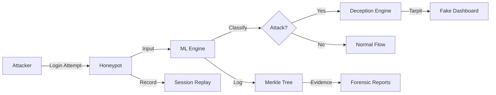

# 🛡️ Chameleon Deception System

> **Advanced Cybersecurity Honeypot with ML-Powered Attack Detection & Forensic Analysis**

[](https://www.python.org/)
[](https://fastapi.tiangolo.com/)
[](https://reactjs.org/)
[](LICENSE)

Chameleon is an intelligent deception platform disguised as a banking application. It detects, deceives, and analyzes attackers attempting SQL Injection (SQLi) and Cross-Site Scripting (XSS) attacks while collecting comprehensive forensic evidence.


---

## 🌟 Features

### 🎯 **ML-Powered Attack Detection**
- Real-time classification using scikit-learn
- 70% confidence threshold to minimize false positives
- Pattern-based fallback for edge cases
- Supports SQLi, XSS, and benign traffic detection

### 🕸️ **Advanced Tarpitting**
- **Time Wasting**: 3-second delays frustrate automated attacks
- **Fake Success Messages**: Deceive attackers into thinking they succeeded
- **Fake Dashboard**: Realistic but non-functional banking interface
- **Infinite Loading**: Trap attackers in endless loading screens

### 🔐 **Cryptographic Integrity**
- Merkle tree blockchain for tamper-proof logs
- SHA-256 hashing of all events
- Real-time Merkle root updates
- Cryptographic proof included in forensic reports

### 🎬 **Session Replay**
- Frame-by-frame playback of attacker actions
- Records keystrokes, clicks, and timing
- Speed controls (0.5x, 1x, 2x)
- Export to JSON for external analysis

### 🤖 **AI-Powered Forensics**
- Intelligent attack explanations
- Severity scoring (1-10)
- Recommended mitigation actions
- Offline fallback mode (no API keys required)

### 📊 **Professional Reporting**
- PDF generation with charts and statistics
- Complete attack timeline
- Merkle root for integrity verification
- Per-IP incident reports

---

## 🏗️ Architecture



### **Tech Stack**

| Layer | Technology |
|-------|-----------|
| **Backend** | FastAPI, Python 3.8+, scikit-learn, SQLite |
| **Frontend** | React 19, Vite, TailwindCSS, Framer Motion |
| **ML/AI** | scikit-learn, TF-IDF, Pattern Matching |
| **Security** | SHA-256, Merkle Tree, ReportLab |
| **Visualization** | Recharts, Chart.js, jsPDF |

---

## 🚀 Quick Start

### Prerequisites

- Python 3.8+
- Node.js 16+
- npm or yarn

### Installation

1. **Clone the repository**
```bash
git clone https://github.com/yourusername/chameleon-deception-system.git
cd chameleon-deception-system
```

2. **Install backend dependencies**
```bash
pip install -r backend/requirements.txt
```

3. **Install frontend dependencies**
```bash
cd client
npm install
```

### Running the Application

**Terminal 1 - Backend:**
```bash
# From project root
python -m backend.main
```
Backend runs on `http://localhost:5000`

**Terminal 2 - Frontend:**
```bash
# From client directory
cd client
npm run dev
```
Frontend runs on `http://localhost:5173`

### Access Points

- **Honeypot (Fake Login)**: `http://localhost:5173/login`
- **Analyst Dashboard**: `http://localhost:5173/dashboard`
  - Credentials: `tanay@chameleon.com` / `admin`

---

## 📖 Usage

### For Attackers (Honeypot Testing)

1. Navigate to `/login`
2. Try SQL injection: `admin' OR 1=1--`
3. Watch the deception unfold:
   - Slow loading (3s delay)
   - "Authentication Successful" message
   - Redirect to fake dashboard
   - Infinite loading screens

### For Analysts (Forensic Analysis)

1. Login with admin credentials
2. View real-time attack logs
3. Analyze statistics and charts
4. Play session replays frame-by-frame
5. Generate AI explanations
6. Download PDF forensic reports

---

## 🔌 API Documentation

### Core Endpoints

| Method | Endpoint | Description |
|--------|----------|-------------|
| `POST` | `/api/analyze` | Analyze input for attacks |
| `GET` | `/api/logs` | Get all attack logs |
| `GET` | `/api/health` | Health check |

### Forensics Endpoints

| Method | Endpoint | Description |
|--------|----------|-------------|
| `GET` | `/api/merkle` | Get current Merkle root |
| `GET` | `/api/report/:ip` | Download PDF report for IP |
| `POST` | `/api/submit` | Submit attack with session data |
| `GET` | `/api/events/:id` | Get event with replay data |

### AI Assistant Endpoints

| Method | Endpoint | Description |
|--------|----------|-------------|
| `POST` | `/api/ai/explain` | Get AI explanation for event |
| `GET` | `/api/ai/explain/:id` | Get explanation by event ID |

### Statistics Endpoints

| Method | Endpoint | Description |
|--------|----------|-------------|
| `GET` | `/api/stats/top-ips` | Top 10 attacking IPs |
| `GET` | `/api/stats/time-series` | 24-hour attack timeline |
| `GET` | `/api/stats/strategies` | Deception strategy counts |
| `GET` | `/api/stats/confidence` | Confidence score statistics |

---

## 🎯 Example Attack Detection

### Request
```bash
curl -X POST http://localhost:5000/api/analyze \
  -H "Content-Type: application/json" \
  -d '{
    "input_text": "User ID: admin'\'' OR 1=1--, Password: test",
    "ip_address": "192.168.1.100"
  }'
```

### Response
```json
{
  "response": {
    "status": 200,
    "message": "Authentication Successful",
    "deception": "Slow Loading + Fake Dashboard Tarpit",
    "action": "slow_loading_then_fake_dashboard"
  },
  "forensics": {
    "detected_type": "SQLi",
    "confidence": 0.95,
    "merkle_root": "abc123def456..."
  }
}
```

---

## 📊 ML Model Details

### Training Data
- **SQLi Dataset**: 723KB (sqli.csv)
- **XSS Dataset**: 1.68MB (xss.csv)
- **Extended SQLi**: 2.3MB (SQLiV3.csv)

### Model Pipeline
1. **TF-IDF Vectorization** - Convert text to numerical features
2. **Classification** - Logistic Regression / Random Forest
3. **Confidence Calibration** - Probability scoring

### Performance Tuning
- Confidence threshold: **0.7** (reduces false positives)
- Pattern-based override for high-confidence attacks
- Fallback to Benign when uncertain

### Attack Patterns Detected

**SQL Injection:**
- `' or`, `or 1=1`, `union select`, `drop table`, `'; --`, `admin' --`

**XSS:**
- `<script`, `javascript:`, `onerror=`, `onload=`, `alert('XSS')</script>
# Observe: Deception response
```

3. **Test Admin Access**
```bash
# Navigate to /login
# Enter: tanay@chameleon.com / admin
# Observe: Real dashboard access
```

### API Testing

```bash
# Test ML prediction
curl -X POST http://localhost:5000/api/test-predict \
  -H "Content-Type: application/json" \
  -d '{"input_text": "admin'\'' OR 1=1--"}'

# Get Merkle root
curl http://localhost:5000/api/merkle

# Download report
curl -o report.pdf "http://localhost:5000/api/report/192.168.1.100"
```

---

## 📚 Documentation

- **[AI Assistant Guide](README_AI_ASSISTANT.md)** - AI forensics system
- **[Merkle Tree Guide](README_MERKLE.md)** - Blockchain integrity
- **[Session Replay Guide](README_SESSION_REPLAY.md)** - Replay system
- **[PDF Reports Guide](README_PDF_REPORT.md)** - Report generation

---

## 🛣️ Roadmap

- [ ] Real-time WebSocket updates
- [ ] Multi-tenant support
- [ ] Advanced ML models (deep learning)
- [ ] SIEM integration
- [ ] Distributed Merkle root publishing
- [ ] Video export of session replays
- [ ] Collaborative analyst features
- [ ] Docker containerization
- [ ] Kubernetes deployment

---

## 🤝 Contributing

Contributions are welcome! Please follow these steps:

1. Fork the repository
2. Create a feature branch (`git checkout -b feature/AmazingFeature`)
3. Commit your changes (`git commit -m 'Add AmazingFeature'`)
4. Push to the branch (`git push origin feature/AmazingFeature`)
5. Open a Pull Request

---

## 📄 License

This project is licensed under the MIT License - see the [LICENSE](LICENSE) file for details.

---

## 🙏 Acknowledgments

- **scikit-learn** - Machine learning framework
- **FastAPI** - Modern Python web framework
- **React** - Frontend library
- **TailwindCSS** - Utility-first CSS framework
- **Framer Motion** - Animation library

---

## 📧 Contact

**Project Maintainer**: Your Name  
**Email**: your.email@example.com  
**Project Link**: [https://github.com/yourusername/chameleon-deception-system](https://github.com/yourusername/chameleon-deception-system)

---

## ⭐ Star History

If you find this project useful, please consider giving it a star!

[](https://star-history.com/#yourusername/chameleon-deception-system&Date)

---

**Built with ❤️ for cybersecurity defense through deception**